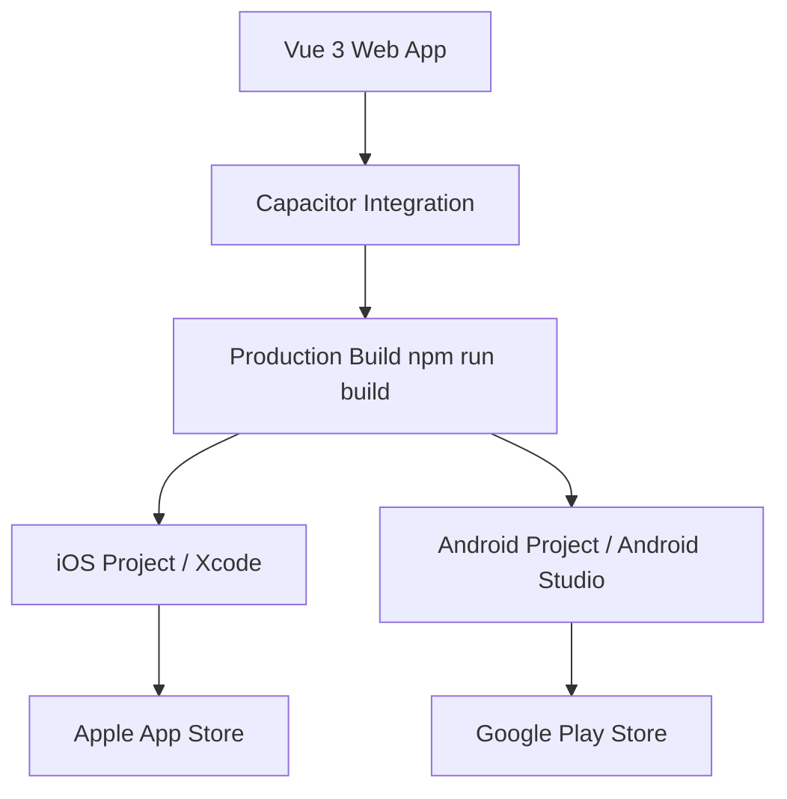

# Mobile Deployment Guide (Apple & Google)

현재 이 프로젝트는 Vue 3 기반의 웹 애플리케이션입니다. 이를 Apple App Store 및 Google Play Store에 배포하기 위해서는 **Capacitor**를 사용하여 하이브리드 앱으로 전환하는 것이 가장 권장되는 방법입니다.

---

## 1. 개요 (Process Overview)



---

## 2. 필수 단계 (Core Steps)

### 2.1 Capacitor 설치 및 초기화
먼저 프로젝트에 Capacitor를 설치하고 초기화해야 합니다.
```bash
# Capacitor 설치
npm install @capacitor/core @capacitor/cli

# 초기화 (App Name: Gym4me, App ID: com.gym4me.app)
npx cap init Gym4me com.gym4me.app --web-dir dist
```

### 2.2 플랫폼 추가
각 모바일 플랫폼 전용 라이브러리를 추가합니다.
```bash
# iOS & Android 플랫폼 추가
npm install @capacitor/ios @capacitor/android
npx cap add ios
npx cap add android
```

### 2.3 동기화 (Sync)
웹 코드가 수정될 때마다 네이티브 프로젝트로 동기화해야 합니다.
```bash
npm run build
npx cap sync
```

---

## 3. 스토어 배포 요구사항

### 3.1 Apple App Store (iOS)
- **개발자 계정**: Apple Developer Program 가입 필수 (연간 $99).
- **장비**: Xcode 실행을 위한 macOS 환경 필수.
- **아이콘/스크린샷**: 각 해상도별 이미지 준비.
- **심사**: 개인정보 처리방침, 앱 기능 설명 등 제출 후 약 1~3일 소요.

### 3.2 Google Play Store (Android)
- **개발자 계정**: Google Play Console 가입 필수 (1회성 $25).
- **장비**: Windows/Mac/Linux 상관없으나 Android Studio 필요.
- **AAB 생성**: Android Studio에서 signed bundle(.aab) 생성.
- **심사**: 구글 정책 준수 여부 확인 후 약 1~7일 소요.

---

## 4. 추가 고려사항 (Functional)

- **Push 알림**: `Firebase Cloud Messaging (FCM)` 연동 필요.
- **네이티브 API**: 카메라(바디필 기록용), 앨범 접근 등 Capacitor Plugin 설치 필요.
- **Firebase Google Login**: 모바일 앱용 별도 SHA-1 지문 등록 및 `GoogleService-Info.plist`, `google-services.json` 설정 필수.

---

## 5. 권장 로드맵
1. **Capacitor 설치**: 현재 웹 프로젝트에 Capacitor 적용.
2. **로컬 테스트**: Xcode/Android Studio 에뮬레이터에서 동작 확인.
3. **아이콘/브랜딩**: 앱 아이콘 및 스플래시 이미지 제작 (Capacitor Assets 활용).
4. **계정 생성**: Apple/Google 개발자 계정 등록.
5. **빌드 및 업로드**: 각 스토어 관리 페이지를 통해 업로드 및 심사 요청.
