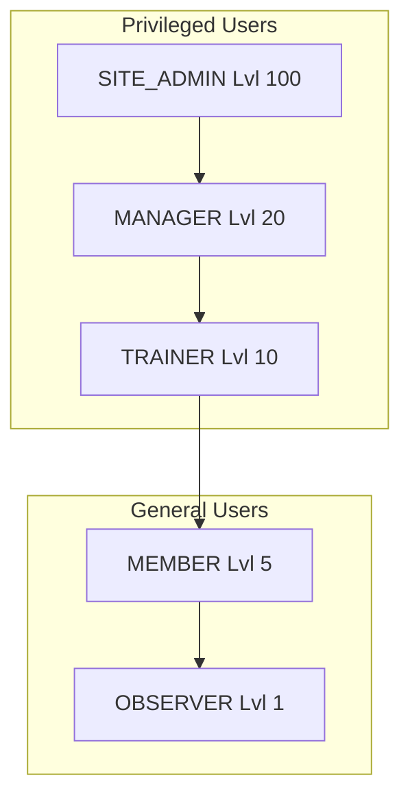

# Gym4me Information Architecture (IA)

## 1. 개요
Gym4me는 헬스장 관리, 트레이너-회원 간 매칭, PT 일정 및 기록 관리를 위한 플랫폼이다. 본 문서는 시스템의 정보 구조, 사용자 역할, 페이지 구성 및 데이터 설계를 정의한다.

---

## 2. 사용자 역할 및 권한 (User Roles)



| 역할 (Role) | 레벨 (Lvl) | 주요 권한 및 기능 |
| :--- | :---: | :--- |
| **SITE_ADMIN** | 100 | 시스템 전체 관리, 매니저(MANAGER) 임명 및 관리, 서비스 로그 확인 |
| **MANAGER** | 20 | 특정 헬스장(Gym) 관리, 트레이너 채용/승인, 지점 통계 확인 |
| **TRAINER** | 10 | 클라이언트(회원) 관리, 클래스 생성/운영, 일정 예약 및 PT 세션 완료처리 |
| **MEMBER** | 5 | 개인 일정 확인, 운동 기록 조회, 수강권 현황 확인, 바디 프로필 기록 |
| **OBSERVER** | 1 | 가입 후 승인 대기 단계, 모든 메뉴 접근 제한 (대기 화면) |

---

## 3. 사이트 구조 (Sitemap)

```mermaid
graph LR
    Root[/] --> Home[Home]
    Root --> Auth[Auth / Login]
    
    Auth --> Dashboard[Dashboard]
    
    Dashboard --> Cal[Calendar / Schedule]
    Dashboard --> Prof[Body Profile]
    Dashboard --> Set[Settings]
    
    subgraph "Trainer Actions"
        Dashboard --> MyClients[Client Management]
        Dashboard --> MyClasses[Class Management]
        Dashboard --> TProf[Trainer Profile]
        Dashboard --> TU[Tool Usage]
    end
    
    subgraph "Admin/Manager Actions"
        Dashboard --> GM[Gym Management]
        Dashboard --> TM[Trainer Management]
        Dashboard --> MM[Manager Management]
        Dashboard --> GMB[Gym Member Management]
    end
    
    Dashboard -.-> Notif[Notification System - TO-DO]
```

### 3.1 공통 (Common)
- **Home (`/`)**: 서비스 소개 및 대시보드 요약
- **Auth (`/auth`)**: 로그인 및 회원가입
- **Settings (`/settings`)**: 프로필 설정, 비밀번호 변경

### 3.2 핵심 기능 (Core)
- **Dashboard (`/dashboard`)**: 역할별 요약 정보 (잔여 세션, 오늘 일정, 소속 회원 등)
- **Calendar (`/calendar`)**: PT 일정(개인/클래스) 관리 및 상세 기록 확인 (2주 보기 지원)
- **Body Profile (`/profile`)**: 신체 데이터(체중, 체지방 등) 변화 시각화
- **Tool Usage (`/tool-usage`)**: 공용 운동기구 가이드 및 개인별 운동 영상 저장소

### 3.3 트레이너 전용 (Trainer Only)
- **Client Management**: 내 회원 목록, 회원 추가(이메일 검색), 수강권 부여
- **Class Management**: 그룹 클래스 생성 및 회원 초대
- **Trainer Profile (`/trainer-profile`)**: 트레이너 경력(수상경력 포함) 및 소개 편집

### 3.4 매니저/관리자 전용 (Manager/Admin Only)
- **Gym Management (`/manage-gym`)**: 헬스장 정보 관리
- **Trainer Management (`/manage-trainers`)**: 소속 트레이너 권한 부여 및 관리
- **Manager Management (`/admin/managers`)**: (Site Admin 전용) 지점 매니저 관리

---

## 4. 데이터 아키텍처 (Data Architecture)

```mermaid
erDiagram
    users ||--o{ gyms : belongs_to
    users ||--o{ users : "managed_by (Trainer/Manager)"
    gyms ||--o{ users : has_manager
    users ||--o{ classes : creates/manages
    classes }o--o{ users : contains_trainees
    classes ||--o{ schedules : has
    users ||--o{ schedules : has_individual_pt
    schedules ||--o{ workoutLogs : contains
    users ||--o{ bodyProfiles : logs
    users ||--o{ ticketHistory : audit_trail
    users ||--o| trainerProfiles : has_bio
```

### 4.1 Firestore Collections
- **`users`**: 사용자 기본 정보 (ID, 이메일, 역할, 레벨, 소속 헬스장, 담당 트레이너 등)
- **`gyms`**: 헬스장 정보 (지점명, 위치, 대표 매니저)
- **`classes`**: 트레이너가 생성한 그룹 수업 (클래스명, 참여 회원 목록)
- **`schedules`**: 캘린더 이벤트 (개인PT/클래스/메모 구분, 상태, 서명, 수행 기록)
- **`workoutLogs`**: 세션별 수행 운동 상세 (종목, 세트, 무게, 횟수)
- **`bodyProfiles`**: 회원 신체 변화 데이터
- **`ticketHistory`**: 수강권 차감 및 충전 이력 (Audit Trail)
- **`trainerProfiles`**: 트레이너 전문 분야 및 자기소개 (수상 경력, 상세 경력 포함)
- **`toolUsage`**: 운동 가이드 영상 및 사진 데이터
- **`adminAuditLogs`**: 관리자 작업 이력 (권한 변경, 삭제 등)

---

## 5. 상태 관리 (Pinia Stores)
- **`auth`**: 로그인 상태 및 사용자 권한(lvl) 관리
- **`scheduleStore`**: 개인 및 클래스 일정 데이터 캐싱 및 CRUD
- **`classStore`**: 트레이너의 클래스 정보 및 참여자 관리
- **`clientStore`**: 트레이너의 담당 회원 목록 및 수강권 관리
- **`profileStore`**: 바디 프로필 및 트레이너 프로필 상태 관리
- **`uiStore`**: 토스트 알림, 로딩 상태 등 전역 UI 컨트롤
